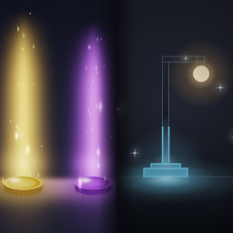

# CoinBeams

[**Get it on Thunderstore**](https://thunderstore.io/c/grain-rot/p/Mentalize/CoinBeams/)

**Find the loot worth carrying, without hunting pixel by pixel.**

Grain Rot marks valuable items with a small sparkle. It is easy to miss in a dark room, and telling a Rare from an Epic usually meant walking up to each one and inspecting it. CoinBeams makes the whole system readable at a glance.

---

## What it does

**Loot beams on coins.** Every gold coin and artifact coin gets a soft, see-through pillar of light rising from it — gold beams on gold, purple on artifact. The beam always points straight up, however the coin lands, tumbles, or flies.

**A rarity glow under valuables.** Furniture, paintings, plants, lamps and treasures each get a small coloured light at their base, in the colour of their tier. A light has no shape and no up-vector, so it sits correctly on a hanging picture just as well as on a floor prop. It never casts shadows and the count is capped per level.

**Brighter sparkles.** The game's own rarity sparkle is amplified rather than replaced — bigger and faster, still scattered across the item's own surface, still in the game's own colours.

---

## Rarity colours

| Tier | Colour |
|---|---|
| Common | White |
| Rare | Blue |
| Excellent | Pale cyan-blue |
| Epic | Purple |

All four tiers are marked by default.

---

## Multiplayer and safety

Purely **client-side visuals**. Nothing is replicated, no gameplay value is changed, and friends do not need the mod installed. Lights never cast shadows, particle work is capped and spread across frames, and all cosmetic work waits for the level to finish streaming before it runs.

---

## Configuration

Open `Scripts/main.lua` and edit the `CFG` block at the top.

| Setting | What it does |
|---|---|
| `ITEM_LIGHT` | Master switch for the rarity glow |
| `ITEM_LIGHT_INTENSITY` | Glow brightness in candelas |
| `ITEM_LIGHT_RADIUS` | How far the glow reaches, in cm |
| `MAX_ITEM_LIGHTS` | Ceiling on lights per level |
| `OUTLINE_MIN_QUALITY` | Lowest tier that gets marked — `0` Common, `1` Rare, `2` Epic |
| `OUTLINE_MAX_QUALITY` | Highest tier that counts as loot — `3` includes Excellent |
| `OUTLINE_COMMON` / `OUTLINE_RARE` / `OUTLINE_EXCELLENT` / `OUTLINE_EPIC` | Tier colours |
| `SPARKLE_SPEED` | Twinkle rate of the item sparkles |
| `SPARKLE_SIZE_MULT` | Sparkle size |
| `ITEM_BEAMS` | Optional upright beam on valuables (off — it misaligns on wall-mounted items) |
| `LAYER_COUNT`, `BASE_H`, `TIP_H` | Coin beam shape and height |

---

## Install

Use a mod manager — it handles the dependency and the file layout for you.

---

## Version catalog

### 1.3.1
- **Lamp-type valuables now get their glow.** Floor lights, lamps and anything else that emits light were skipped entirely — the check that prevents double-lighting asked whether the item already owned a light component, which is true of every lamp by definition. It now tracks only the lights this mod adds.
- **Items no longer need to be approached or nudged first.** The game puts particle systems to sleep when you are not near them, and sleeping sparkles were being ignored, so an item stayed dark until you walked up to it or picked it up. A room now lights up as you enter it.
- Added a fallback for items that refuse a light on the first attempt, and raised the per-level light ceiling from 28 to 64 now that far more valuables are found.
- New icon.

### 1.3.0
- **Excellent tier now supported.** The game has a fourth rarity above Epic that inspects as "Excellent" and carries its own pale-blue sparkle. Every earlier version discarded those items outright, so they never got a glow. They are now marked in their own colour.
- **Furniture is marked properly.** Chairs, tables, paintings, floor lamps and plant pots were being skipped because the mod only looked for treasure-class objects. It now treats anything the game attaches its rarity sparkle to as loot, which covers every sellable prop type.
- **The sparkle boost actually applies.** A component test was checking a property that does not exist, so the pass that enlarges and speeds up the game's own sparkles had never once run. Sparkles are now noticeably livelier.
- Glow retuned much softer after testing — it marks the item without lighting the room.
- Sparkle colours are correct on every tier. Extra sparkle copies are no longer added, because a spawned copy keeps the shared effect's purple tint regardless of colour settings and contaminated white and blue items.

### 1.2.2
- Description corrected to match what the mod actually does.

### 1.2.1
- New icon.
- Rarity light brightness doubled.
- Sparkle density scaled to each item's measured size, so a large item reads as clearly as a small one.

### 1.2.0
- Found the real item sparkle effect — earlier versions had been enhancing the coin effect, which is why item sparkles never changed.
- Item sparkles enhanced directly, so they stay glued to the item's surface and align correctly on wall-mounted pictures.
- Added the rarity light.
- Item beams turned off by default; they sprouted out of picture frames.
- Fixed an intermittent crash on loading in.

### 1.1.2
- Fixed a crash on load caused by building far too much geometry per item.
- Item markers made much smaller; the old ones punched through ceilings.

### 1.1.1
- Valuables given a rarity-coloured marker.
- Common items included alongside Rare and Epic.

### 1.1.0
- First pass at marking valuables by rarity.
- Bigger, faster coin sparkles.

### 1.0.2
- Beams on freshly dropped coins now appear instantly instead of seconds late.
